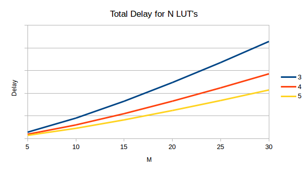
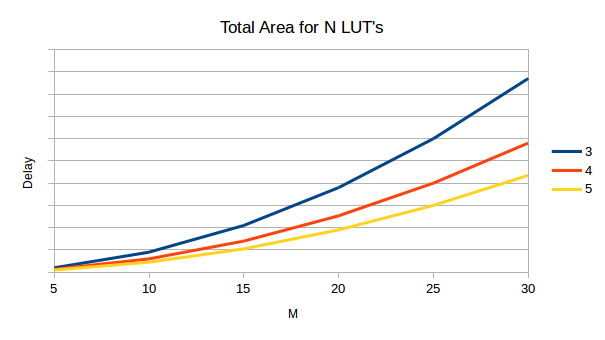
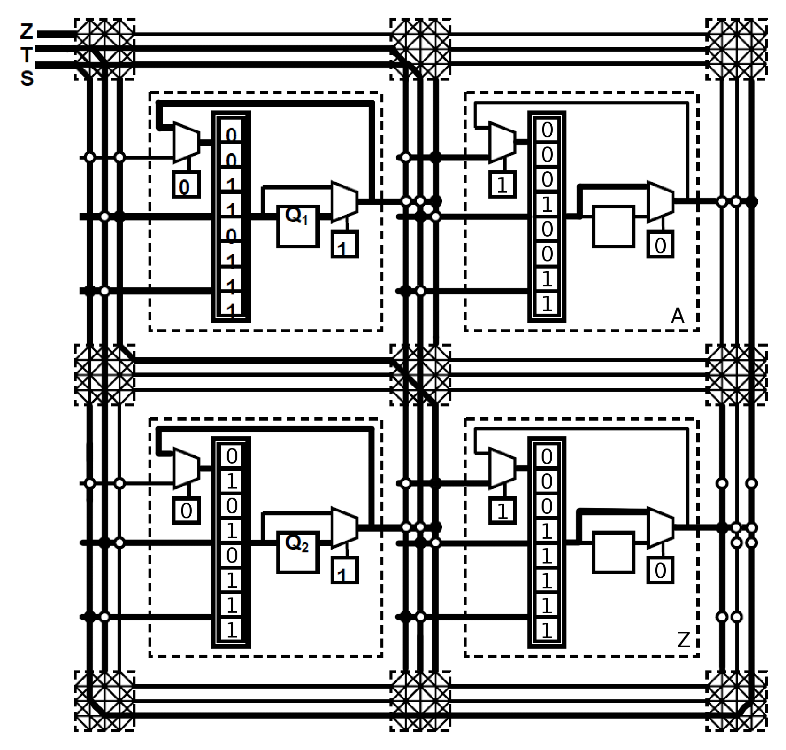

# ELEC4320 HW2
## Dhesant Nakka - 20146587 - 9 November 2015

## 1)
### a)
Implementation 1 (conventional cascaded approach):  
1 CLB's and 1 delay for every bit.  
=> Total of 8 Spartan CLB's and 8 CLB delays.

Implementation 2 (5-input LUT approach):  
1.5 CLB's and 0.5 delays for every bit.  
=> Total of 12 Spartan CLB's and 4 CLB delays.

### b)
Carry Logic Approach:  
0.5 CLB's for every bit. 1 CLB delay in total.  
=> Total of 4 CLB's and 1 CLB delay.

### c)
For a 4-bit x 4-bit multiplier, there are 16 (4x4) AND gates (1-bit multiplication), 3 4-bit adders, this results in a different number of CLB's depending on which adder approach is taken.  
For the conventional cascaded approach, this is equal to 16 + (3 x 4) = 28 CLB's.  
For the 5-input LUT approach, this is equal to 16 + (3 x 6) = 34 CLB's.  

## 2)
### a)
Minimum LUTs = 1 + (M - N)/(N - 1)  
Total Delay = (1 + (M - N)/(N - 1)) x c1 x log(N)  
Total Area = (1 + (M - N)/(N - 1)) x c2 x N  

### b)

From the first graph, it is better to have N = 5 to have the least delay in the circuit, and from the second graph, it is better to have N = 5 to minimize the area needed for the circuit. However, if M <= 3, it is better to use a 3-input LUT, and if M = 4, it is better to use a 4-input LUT, because having the extra capacity of a 5-input LUT in both scenearios just increases the delay and area required unecessarily.

### c)
M = 8, N = 4  
=> Minimum LUTs = 1 + (8 - 4)/(4 - 1) = 1 + 4/3 = 2.333 = 3 LUTs  
=> Total Delay = 3 x c1 x log(4) = 4.159 x c1  
=> Total Area = 3 x c2 x 4 = 12 x c2  

Currently, the LUT's are in the cascaded system, however, by rearranging it into a tree, we can reduce the delay to 2.772 x c1. However, the area remains fixed at 12 x c2, because the system needs 8 inputs for M, and some more inputs for the LUT's to feed into each other, which requires more than 2 LUT's to accomplish.

## 3)
| Q1 | Q2 | S | Q1+ |
|:--:|:--:|:-:|:---:|
| 0  | 0  | 0 | 0   |
| 0  | 0  | 1 | 0   |
| 0  | 1  | 0 | 1   |
| 0  | 1  | 1 | 1   |
| 1  | 0  | 0 | 0   |
| 1  | 0  | 1 | 1   |
| 1  | 1  | 0 | 1   |
| 1  | 1  | 1 | 1   |

| Q1 | Q2 | S | T | Q2+ |
|:--:|:--:|:-:|:-:|:---:|
| 0  | 0  | 0 | 0 | 0   |
| 0  | 0  | 0 | 1 | 0   |
| 0  | 0  | 1 | 0 | 0   |
| 0  | 0  | 1 | 1 | 1   |
| 0  | 1  | 0 | 0 | 0   |
| 0  | 1  | 0 | 1 | 1   |
| 0  | 1  | 1 | 0 | 0   |
| 0  | 1  | 1 | 1 | 1   |
| 1  | 0  | 0 | 0 | 0   |
| 1  | 0  | 0 | 1 | 0   |
| 1  | 0  | 1 | 0 | 1   |
| 1  | 0  | 1 | 1 | 1   |
| 1  | 1  | 0 | 0 | 0   |
| 1  | 1  | 0 | 1 | 1   |
| 1  | 1  | 1 | 0 | 1   |
| 1  | 1  | 1 | 1 | 1   |

| Q1 | S | T | A (SQ1+ST) |
|:--:|:-:|:-:|:----------:|
| 0  | 0 | 0 | 0          |
| 0  | 0 | 1 | 0          |
| 0  | 1 | 0 | 0          |
| 0  | 1 | 1 | 1          |
| 1  | 0 | 0 | 0          |
| 1  | 0 | 1 | 0          |
| 1  | 1 | 0 | 1          |
| 1  | 1 | 1 | 1          |

| Q2 | T | A | Q2+ |
|:--:|:-:|:-:|:---:|
| 0  | 0 | 0 | 0   |
| 0  | 0 | 1 | 1   |
| 0  | 1 | 0 | 0   |
| 0  | 1 | 1 | 1   |
| 1  | 0 | 0 | 0   |
| 1  | 0 | 1 | 1   |
| 1  | 1 | 0 | 1   |
| 1  | 1 | 1 | 1   |

| Q2 | S | T | Z |
|:--:|:-:|:-:|:-:|
| 0  | 0 | 0 | 0 |
| 0  | 0 | 1 | 0 |
| 0  | 1 | 0 | 0 |
| 0  | 1 | 1 | 1 |
| 1  | 0 | 0 | 1 |
| 1  | 0 | 1 | 1 |
| 1  | 1 | 0 | 1 |
| 1  | 1 | 1 | 1 |

